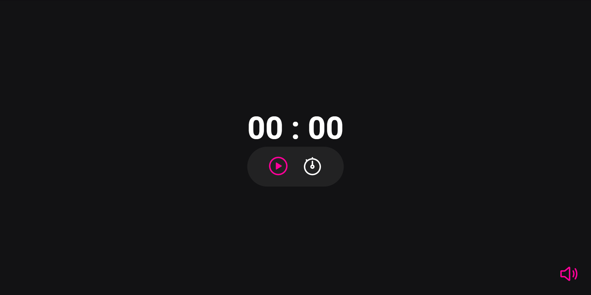

<h1 style="text-align:center">Focus Timer</h1>

## Sobre 
O Focus Timer é um temporizador desenvolvido para que o usuário tenha um maior controle do seu tempo e consequentemente aumente a sua produtividade.
## Como funciona
1. Clique no ícone do relógio.
2. Digite a quantidade de minutos desejada.
3. Dê play.
4. Pause/Pare a aplicação no momento que desejar.
5. Quando o tempo chegar ao fim, a aplicação irá ativar um alarme sonoro para informar que o temporizador chegou ao fim.

## Tecnologias
- HTML
- CSS
- Javascript